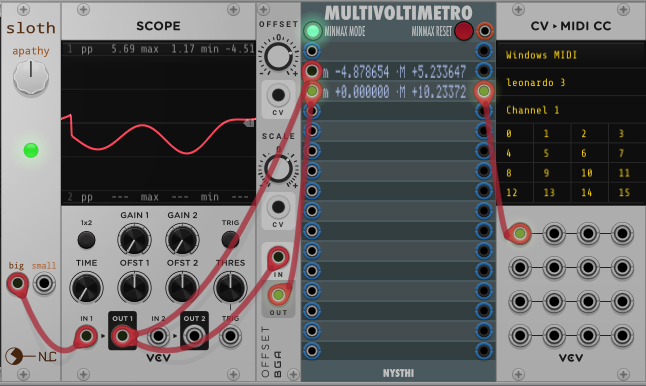
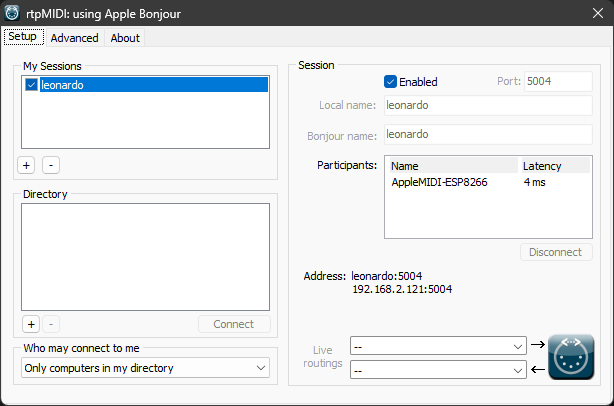
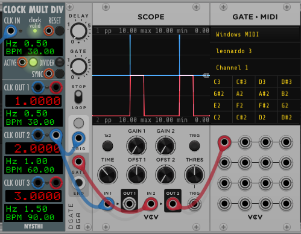

# MIDI to CV (ESP8266, MCP4728, AppleMIDI Library)
In this project I convert MIDI messages to control voltage and triggers via the AppleMIDI using an ESP8266 and two MCP4728.

## Goals
I use VCV Rack as my DAW and I wanted to have a hybrid setup where I would be able to send "virtual" control voltage to my real synthesizers. In my case from VCV Rack on my PC (https://vcvrack.com/) or miRack (https://mirack.app/) on my iPad to my AEmodular synth from https://www.tangiblewaves.com/.

Having 4 output jacks is good. But I thought it would be better to have 8. So I wanted to use two MCP4728. I also wanted to be able to send triggers. For now I use 4 output PINs from the ESP8266.

I am not good at soldering and I don't have experience designing electrical circuits. So I decided to use a programmable microcontroller (in this case the ESP8266) using Arduino libraries. I just had to combine the examples from two libraries (see details below). I plugged everything together on a breadboard.

## Code from the AppleMIDI-Library example
To keep the latency low, I wanted to connect my PC or iPad directly to the ESP8266. My code is based on this example from the AppleMIDI-Library:
https://github.com/lathoub/Arduino-AppleMIDI-Library/blob/master/examples/ESP8266_NoteOnOffEverySec_softAP_mDNS/ESP8266_NoteOnOffEverySec_softAP_mDNS.ino

This code shows how to set up an Access Point on the ESP8266 so that my PC or iPad can connect to the ESP8266.

## Code from the ESP8266 WiFi examples (Range Extender)
When you use the example above, your PC or iPad is not connected to the internet anymore. I used this example from  the ESP8266 WiFi examples to set up an Access Point which forwards the traffic to the internet:
https://github.com/esp8266/Arduino/blob/master/libraries/ESP8266WiFi/examples/RangeExtender-NAPT/RangeExtender-NAPT.ino

Note: you should not download a lot of data while using the MIDI module because this increases the latency. And the bandwidth is very limited. So your downloads will be slower. But it is better than being disconnected from the internet completely.

## Changing the device ID of the MCP4728
The MCP4728 boards all have the same ID. But you can change the ID so that you can use more that one board. It was a bit tricky but in the end it worked for me. I used the code from this project:
https://github.com/TrippyLighting/HPRGB2/blob/master/examples/changeDeviceID/changeDeviceID.ino

See also
https://forum.arduino.cc/t/mcp4728-x2-with-and-without-multiplexer-tc9548a-resolved/983859

This _i2c-scanner.ino_ Github Gist helped me finding the IDs
https://gist.github.com/netmaniac/8706f2f7ae5dbfe6498e04bf1cbfde4a

## How it works
This section describes how all the components work together and how they are connected.

### Connections
* The ESP8266 is powered via the USB input (plugged into a computer or a power bank)
* D1 of the ESP8266 into the CL input of the MCP4728
* D2 of the ESP8266 into the DA input of the MCP4728
* Ground from the ESP8266 into the G input of the MCP4728
* 3V from the ESP8266 into  the V input of the MCP4728
* Also: connect the respective inputs of the two MCP4728 boards
* The trigger output PINs are D3, D4, D5 and D6

### VCV Rack Modules
* _CV->MIDI CC_ module https://vcvrack.com/manual/Core#CV-CC
* _Gate->MIDI_ module https://vcvrack.com/manual/Core#CV-Gate

### rtpMIDI Software
I use Tobias Erichsens rtpMIDI software and it works great for me
https://www.tobias-erichsen.de/software/rtpmidi.html

## Why didn't you use ...?
### MIDI via Bluetooth
I didn't use MIDI via bluetooth for two reasons.

It was difficult to set up on Windows. I tried _BLE-MIDI Connect_ (https://apps.microsoft.com/detail/9nvmlzttwwvl) and _MIDIberry_ (https://apps.microsoft.com/detail/9n39720h2m05). It worked somehow but not as smooth as I hoped.

But mainly I didn't use a BLE-MIDI library (for example https://github.com/max22-/ESP32-BLE-MIDI) for this project because I have an old iPad where the MIDI via Bluetooth connection didn't work. I have a project where I use an ESP32 with the BLE-MIDI library (https://github.com/duddex/ESP32-BLEMIDI2CV). But this only works with my new iPad.

### ESP32
This will be my next project.

## Findings / Know issues / Limitations
* The max output voltage from the MCP4728 modules in this setup is only 3.3v
* Using the  VCV Rack "CV->MIDI CC" module  0v is MIDI value 0 and 10v is MIDI value 127
  * Negative VCV Rack voltages result in MIDI value 0
  * Use (for example) the _OFFSET_ module from Bogaudio (https://library.vcvrack.com/Bogaudio/Bogaudio-Offset) to make sure that the voltage is in the correct range from 0v to 10v
* D2 is also internal LED
  * If D2 is low, the LED is on
  * IF D2 in high, the LED is on
* It is possible that the trigger output is too short
  * You can use the _DGate_ module from Bogaudio (https://library.vcvrack.com/Bogaudio/Bogaudio-DGate) to extend the trigger length. See example below
* Higher latency when debug output is enabled
  * Remove the `DBG(F("ControlChange")` line in `setHandleControlChange` if you the latency gets too high

## Examples
### Sloth
In this example I use the _Sloth Apacy_ module from Nonlinear Circuits (https://library.vcvrack.com/NonlinearCircuits/SlothApathy).

The value for offset in the  _OFFSET_ module is set to 5v so that the output voltage is between 0v and 10v (actually 10.23372v in my screenshot).

The _MULTIVOLTIMETRO_ module is just used for testing. It is not necessary to include the module in a patch.

The output of the _OFFSET_ module is patched into the _CV->MIDI CC_ module and the CC messages are sent to MIDI channel 1 on CC channel 0. On my PC I have connected rtpMIDI to my ESP8266. My computer's name is leonardo. So this is the name that shows up in the _CV->MIDI CC_ module as the name of the MIDI device.

### DGate
When you send triggers which are very short (as triggers usually are because they are triggers) the NoteOn and NoteOff messages are sent almost at the same time. This could lead to dropouts.

You can use the _DGate_ module from Bogaudio (https://library.vcvrack.com/Bogaudio/Bogaudio-DGate) to extend the trigger length.

In this picture you see the trigger as a blue line and the "extended" trigger (gate) as red line. Here I set the gate length to 0.2 seconds.
